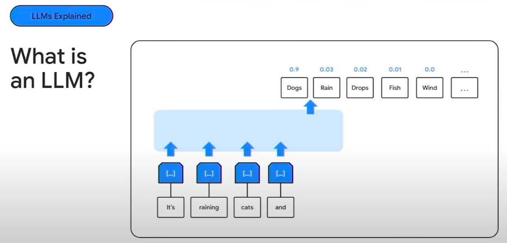

# Imersão IA

### IA Predativa vs. IA Generativa: Entendendo as Diferenças

A inteligência artificial (**IA**) abrange um vasto campo com diversas aplicações e abordagens. Duas categorias que ganharam destaque são a **IA Predativa** e a **IA Generativa**. Embora ambas utilizem algoritmos complexos e aprendizado de máquina, seus objetivos e funcionalidades são distintos. Vamos explorar as principais diferenças:

<mark>**IA Predativa:**</mark>

- **Foco:** Análise e previsão.
- **Objetivo:** Extrair insights de dados existentes para prever resultados futuros ou identificar padrões ocultos.
- **Funcionalidades:**
  - **Classificação:** Categorizar dados em grupos predefinidos (ex: detecção de spam).
  - **Regressão:** Prever valores numéricos com base em dados históricos (ex: previsão de preços de ações).
  - **Clustering:** Agrupar dados com base em similaridades (ex: segmentação de clientes).
- **Exemplos:** Sistemas de recomendação, detecção de fraudes, análise de risco, diagnósticos médicos.

<mark>**IA Generativa:**</mark>

- **Foco:** Criação e geração.

- **Objetivo:** Produzir novos conteúdos, como texto, imagens, música ou código, que sejam semelhantes aos dados de treinamento.

- **Funcionalidades:**

  - **Geração de texto:** Criar histórias, poemas, artigos, etc.
  - **Geração de imagens:** Produzir imagens realistas ou abstratas.
  - **Geração de música:** Compor melodias e harmonias.
  - **Geração de código:** Escrever código em diferentes linguagens de programação.

- **Exemplos:** Chatbots, criação de arte, composição musical, design de produtos.

  

**Em resumo:**

- **IA Predativa:** :arrow_right: Analisa o passado para prever o futuro.
- **IA Generativa:** :arrow_right: Cria novos conteúdos baseados em exemplos existentes.

Ambas as abordagens têm um enorme potencial para revolucionar diferentes setores e impulsionar a inovação. A escolha entre **IA Predativa** e I**A Generativa** depende do objetivo específico e do tipo de problema que se deseja resolver.*

**LLM** :arrow_right: Large Language Model​

É apresentado um conteúdo muito vasto de informações e esse modelo vai aprender a modelar e agrupar essas informações, como elas se relacionam, cria uma conexão com todos os dados e trabalhar com probabilidades em cima de todas as informações.

**Multimodalidade** :arrow_right: Treinamento com múltiplos formatos de dados ao mesmo tempo.

 

**Google AI Studio**

https://aistudio.google.com/app/prompts/new_chat

---

## Engenharia de Prompt

#### Principais Padrões:

- Dividir tarefas grandes em tarefas menores relacionadas.

- Pedir para o modelo dar justificativas sobre análises.

  

**Padrões para Melhorar a Precisão e Clareza:**

- **Instruções Explícitas:** Dê instruções claras e específicas sobre o formato e conteúdo desejado. Por exemplo, "Escreva um poema no estilo de Shakespeare sobre o amor perdido."

- **Exemplos:** Forneça exemplos de entrada e saída desejada para guiar o modelo.

- **Restrições:** Defina limites para o conteúdo gerado, como comprimento, estilo ou tópicos a serem evitados.

- **Papéis:** Atribua um papel específico ao modelo, como "professor", "cientista" ou "crítico", para influenciar o tom e o estilo da resposta.

- **Pensamento em Cadeia:** Peça ao modelo para dividir o raciocínio em etapas, mostrando como chega à resposta.

  

**Padrões para Criatividade e Exploração:**

- **Analogias e Metáforas:** Use analogias para estimular o pensamento criativo e gerar ideias inovadoras.

- **Contrafactuais:** Explore cenários hipotéticos e "e se" para gerar resultados inesperados.

- **Inversão de Papéis:** Peça ao modelo para assumir a perspectiva de outra pessoa ou entidade.

  

**Padrões para Controle e Ajustes:**

- **Temperatura:** Ajuste a "temperatura" do modelo para controlar a aleatoriedade e a criatividade da resposta.

- **Top-k/Top-p Sampling:** Limite o conjunto de opções consideradas pelo modelo para gerar respostas mais focadas.

  

**Ferramentas e Recursos:**

- **Prompt libraries:** Explore bibliotecas de prompts existentes para encontrar inspiração e exemplos.

- **Prompt engineering tools:** Utilize ferramentas que auxiliam na criação e teste de prompts.

  

#### As Quatro Camadas do Gemini

- Engenharia de Prompt;

- Parâmetros de Execução;

- Configurações de Segurança;

- Redução intrínseca do modelo para informações inventadas ou alucinadas.

  

#### Instruções de comandos

:point_right:https://ai.google.dev/gemini-api/docs/prompting-strategies?hl=pt-br

---

### Técnicas de Prompts :robot:

#### <mark>Zero-Shot Prompting:  Inovação e Desafios</mark>

https://arxiv.org/abs/2005.14165 

:point_right: **Zero-shot prompting** é uma técnica fascinante no campo do aprendizado de máquina, especificamente no contexto de modelos de linguagem grandes (LLMs). Ao contrário dos métodos tradicionais que exigem exemplos de treinamento específicos para cada tarefa, o zero-shot prompting permite que os LLMs executem tarefas para as quais eles não foram explicitamente treinados, simplesmente fornecendo instruções ou descrições da tarefa no prompt.

**Como funciona:**

1. **Prompt de instrução:** O usuário fornece um prompt que inclui uma descrição clara da tarefa, instruções sobre o formato de saída desejado e, opcionalmente, alguns exemplos ilustrativos.
2. **Interpretação do LLM:** O LLM processa o prompt, entendendo a tarefa e os requisitos de saída.
3. **Execução da tarefa:** Com base em seu conhecimento prévio e compreensão do prompt, o LLM gera uma resposta ou realiza a tarefa solicitada.

**Benefícios do Zero-Shot Prompting:**

- **Versatilidade:** Permite que os LLMs executem uma ampla variedade de tarefas sem treinamento específico para cada uma.
- **Adaptabilidade:** Os LLMs podem ser rapidamente adaptados a novas tarefas e domínios simplesmente alterando o prompt.
- **Eficiência:** Elimina a necessidade de conjuntos de dados de treinamento específicos para cada tarefa, economizando tempo e recursos.

**Desafios do Zero-Shot Prompting:**

- **Qualidade da saída:** A qualidade das respostas pode variar dependendo da clareza e da completude do prompt.
- **Interpretação ambígua:** LLMs podem interpretar mal as instruções, resultando em saídas inesperadas ou incorretas.
- **Conhecimento factual limitado:** LLMs podem não ter o conhecimento factual necessário para realizar certas tarefas com precisão.

**Exemplos de aplicações:**

- **Tradução de idiomas:** Traduzir um texto para um idioma para o qual o LLM não foi explicitamente treinado.

- **Resumir textos:** Criar um resumo de um artigo ou documento, especificando o comprimento e o nível de detalhe desejados.

- **Responder perguntas:** Responder a perguntas sobre um determinado tópico, mesmo que o LLM não tenha sido treinado em um conjunto de dados de perguntas e respostas específico.

  

> :information_source:   **Zero-shot prompting é uma área de pesquisa ativa e em constante evolução. Com o desenvolvimento de LLMs mais poderosos e técnicas de prompting mais sofisticadas, podemos esperar que essa abordagem se torne cada vez mais eficaz e versátil, abrindo portas para novas e emocionantes aplicações.**

### <mark>Few-Shot Learning: Aprendizado com Poucos Exemplos </mark>

 https://arxiv.org/abs/2309.13205

:point_right: O **Few-Shot Learning**, ou aprendizado com poucos exemplos, é uma subárea do aprendizado de máquina que se concentra no desenvolvimento de modelos capazes de aprender novas tarefas com um número muito limitado de exemplos de treinamento. Essa abordagem contrasta com o aprendizado tradicional de máquina, que geralmente requer grandes conjuntos de dados para atingir um bom desempenho.

**Desafios do Few-Shot Learning:**

- **Overfitting:** Com poucos exemplos, os modelos podem facilmente se ajustar demais aos dados de treinamento, resultando em um desempenho ruim em dados não vistos.
- **Generalização:** É difícil para os modelos generalizar para novos exemplos quando eles têm apenas alguns exemplos para aprender.
- **Representação de conhecimento:** Os modelos precisam aprender representações eficientes do conhecimento que capturem as características essenciais da tarefa com poucos exemplos.

**Abordagens do Few-Shot Learning:**

- **Meta-aprendizado:** Os modelos são treinados em uma variedade de tarefas de aprendizado com poucos exemplos, aprendendo a aprender novas tarefas de forma eficiente.
- **Aprendizado por transferência:** O conhecimento aprendido em tarefas com muitos dados é transferido para novas tarefas com poucos exemplos.
- **Aumento de dados:** Técnicas de aumento de dados são usadas para criar exemplos de treinamento adicionais a partir dos poucos exemplos disponíveis.
- **Redes neurais siamesas:** Essas redes aprendem a comparar exemplos e determinar se eles pertencem à mesma classe ou não.
- **Redes de correspondência de protótipos:** Os modelos aprendem a representar cada classe por um protótipo e classificam novos exemplos com base na proximidade com os protótipos.

**Aplicações do Few-Shot Learning:**

- **Classificação de imagens:** Classificar novas categorias de imagens com apenas alguns exemplos de cada categoria.

- **Reconhecimento de objetos:** Identificar objetos em imagens ou vídeos com poucos exemplos de treinamento.

- **Processamento de linguagem natural:** Tarefas como tradução automática, análise de sentimento e resposta a perguntas com poucos dados de treinamento.

- **Robótica:** Robôs podem aprender novas habilidades com poucas demonstrações.

  

> :information_source: **O Few-Shot Learning é uma área de pesquisa ativa e promissora com o potencial de revolucionar a forma como os modelos de aprendizado de máquina são treinados e implantados. Ao permitir que os modelos aprendam com poucos exemplos, o Few-Shot Learning torna o aprendizado de máquina mais acessível e aplicável a uma gama mais ampla de problemas do mundo real.**
>
> 

### <mark>Chain-of-Thought Prompting: Raciocínio Passo a Passo</mark>

https://arxiv.org/abs/2201.11903

:point_right: **Chain-of-Thought (CoT) prompting** é uma técnica inovadora que visa melhorar o raciocínio e as habilidades de resolução de problemas de modelos de linguagem grandes (LLMs). Ao contrário do prompting padrão, que busca respostas diretas, o CoT prompting incentiva o modelo a decompor o processo de raciocínio em etapas intermediárias, explicando sua linha de pensamento antes de chegar à resposta final.

**Como funciona:**

1. **Prompt com raciocínio:** O usuário fornece um prompt que inclui não apenas a pergunta, mas também uma demonstração de como chegar à resposta através de etapas de raciocínio explícitas.

2. **Aprendizado por imitação:** O LLM analisa o exemplo de raciocínio no prompt e aprende a imitar esse estilo de pensamento passo a passo.

3. **Resolução com etapas:** Quando apresentado a uma nova pergunta, o LLM gera uma série de etapas de raciocínio, explicando seu processo de pensamento, antes de fornecer a resposta final.

   

**Benefícios do Chain-of-Thought Prompting:**

- **Melhora o raciocínio:** Ao decompor o problema em etapas, o modelo é forçado a pensar de forma mais estruturada e lógica.

- **Aumenta a transparência:** As etapas de raciocínio fornecem insights sobre o processo de pensamento do modelo, tornando suas decisões mais compreensíveis.

- **Melhora a precisão:** O raciocínio passo a passo pode ajudar a evitar erros e a chegar a respostas mais precisas.

- **Facilita a depuração:** Se a resposta final estiver incorreta, as etapas de raciocínio podem ajudar a identificar onde o modelo cometeu um erro.

  

**Desafios do Chain-of-Thought Prompting:**

- **Complexidade do prompt:** Criar prompts com exemplos de raciocínio pode ser desafiador, especialmente para problemas complexos.

- **Tendência à alucinação:** Os modelos podem inventar etapas de raciocínio que não são logicamente sólidas ou factualmente corretas.

- **Controle do nível de detalhe:** Pode ser difícil controlar o nível de detalhe nas etapas de raciocínio geradas pelo modelo.

  

**Exemplos de aplicações:**

- **Resolução de problemas de matemática:** O modelo pode explicar como chegou à resposta de um problema de matemática, mostrando as etapas de cálculo.

- **Respostas a perguntas de raciocínio lógico:** O modelo pode demonstrar como chegou à conclusão de um enigma ou problema lógico.

- **Interpretação de texto:** O modelo pode explicar como chegou à interpretação de um texto, mostrando as inferências que fez ao longo do caminho.

  

> :information_source:  **Chain-of-Thought prompting é uma técnica poderosa que tem o potencial de desbloquear novas capacidades de raciocínio e resolução de problemas em LLMs. À medida que a pesquisa avança, podemos esperar que os modelos se tornem mais habilidosos em raciocínio passo a passo, levando a aplicações ainda mais impressionantes.**

### <mark>Least-to-Most Prompting: Do Simples ao Complexo</mark>

:point_right: **Least-to-Most Prompting** é uma técnica de elicitação de informações que se concentra em guiar o modelo de linguagem passo a passo, começando com perguntas simples e gradualmente aumentando a complexidade para obter informações mais detalhadas e específicas.

**Como funciona:**

1. **Perguntas iniciais simples:** O processo começa com perguntas básicas e fáceis de responder, estabelecendo um contexto e obtendo informações gerais sobre o tópico.

2. **Aumento gradual da complexidade:** A partir das respostas iniciais, o usuário formula perguntas mais específicas e detalhadas, aprofundando-se no assunto.

3. **Exploração de diferentes aspectos:** As perguntas podem abordar diferentes perspectivas, ângulos ou níveis de análise para obter uma compreensão abrangente.

4. **Uso de informações anteriores:** As respostas anteriores são utilizadas para formular novas perguntas, criando uma cadeia de raciocínio e construção de conhecimento.

   

**Benefícios do Least-to-Most Prompting:**

- **Clareza e foco:** A abordagem gradual permite que o modelo se concentre em cada etapa do processo, evitando sobrecarga de informações.

- **Construção de contexto:** As perguntas iniciais estabelecem um contexto sólido para as perguntas subsequentes, permitindo respostas mais precisas e relevantes.

- **Exploração aprofundada:** A técnica permite explorar diferentes aspectos do tópico, obtendo uma visão holística e abrangente.

- **Adaptabilidade:** O processo pode ser ajustado de acordo com as respostas do modelo, permitindo flexibilidade na direção da conversa.

  

**Desafios do Least-to-Most Prompting:**

- **Tempo e paciência:** A abordagem gradual pode ser demorada, exigindo paciência para construir o conhecimento passo a passo.

- **Planejamento das perguntas:** É necessário um bom planejamento para garantir que as perguntas sejam sequenciais e levem a informações relevantes.

- **Risco de desvio:** O modelo pode se desviar do tópico se as perguntas não forem cuidadosamente formuladas.

  

**Exemplos de aplicação:**

- **Entrevistas:** Começar com perguntas gerais sobre a experiência do candidato e, em seguida, aprofundar em habilidades e qualificações específicas.

- **Investigações:** Começar com perguntas amplas sobre um incidente e, em seguida, focar em detalhes específicos para reconstruir os eventos.

- **Aprendizado:** Introduzir um novo conceito com informações básicas e, em seguida, explorar aplicações e exemplos mais complexos.

  

> :information_source:  **Least-to-Most Prompting é uma técnica valiosa para elicitar informações de forma estruturada e eficaz. Ao começar com o básico e gradualmente aumentar a complexidade, é possível obter uma compreensão mais profunda e completa de qualquer tópico.**

#### <mark>Self-consistency</mark>

:point_right: A técnica de self-consistency em prompting é uma abordagem que visa melhorar a qualidade e a coerência das respostas geradas por modelos de linguagem. Ela se baseia na ideia de que, ao solicitar ao modelo que gere múltiplas respostas para a mesma pergunta, mas com pequenas variações no prompt, podemos identificar as respostas mais consistentes e, portanto, mais prováveis de serem corretas.

**Como funciona:**

1. **Geração de múltiplos prompts:** Você cria várias versões do prompt original, modificando ligeiramente a formulação, o contexto ou as instruções.
2. **Solicitação de respostas:** O modelo de linguagem gera respostas para cada um dos prompts modificados.
3. **Comparação e análise:** As respostas são comparadas para identificar as informações que são consistentes em todas ou na maioria delas. Essas informações são consideradas mais confiáveis e precisas.
4. **Seleção da resposta final:** Com base na análise de consistência, você seleciona a resposta final, que pode ser uma das geradas pelo modelo ou uma combinação das informações mais consistentes.

**Benefícios da Self-Consistency:**

- **Melhora a precisão:** Ao identificar as informações consistentes, a técnica ajuda a filtrar respostas incorretas ou inconsistentes.
- **Aumenta a confiabilidade:** A consistência nas respostas indica uma maior probabilidade de que a informação seja verdadeira.
- **Reduz o viés:** Ao variar o prompt, você reduz a chance de que um viés específico na formulação da pergunta influencie a resposta.
- **Melhora a robustez:** O modelo se torna mais robusto a pequenas mudanças no prompt, o que é importante para aplicações do mundo real.

**Exemplos de aplicação:**

- **Resumos de texto:** Gerar múltiplos resumos com diferentes prompts e selecionar as informações que aparecem em todos eles.
- **Tradução:** Traduzir um texto com diferentes prompts e escolher a tradução mais consistente.
- **Geração de ideias:** Gerar ideias para um projeto com diferentes prompts e escolher as ideias mais recorrentes e consistentes.

**Limitações:**

- **Pode ser computacionalmente caro:** Gerar múltiplas respostas aumenta o tempo e os recursos necessários.

- **Nem sempre é possível identificar uma resposta claramente consistente:** Em alguns casos, as respostas podem variar significativamente, mesmo com pequenas mudanças no prompt.

  

> :information_source:  **A self-consistency é uma técnica poderosa para melhorar a qualidade das respostas geradas por modelos de linguagem. Ao considerar a consistência das informações, você pode obter resultados mais precisos, confiáveis e robustos.**

---

### Primeiros Passos Google AI Studio

https://cursos.alura.com.br/imersoes/aulas/aula-3-explorando-os-parametros-do-google-ai-studio-c130